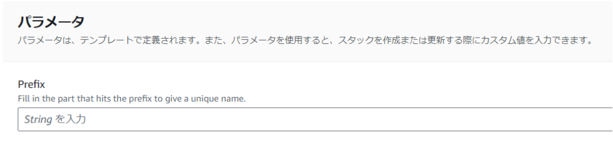

# CloudFormationテンプレートの中で扱うAWSリソースのパスワードをパラメータストアで管理する手順。
1. マネジメントコンソールの検索欄に「Systems Manager」と検索して選択します。
2. 左のサイドバーの「パラメータストア」→「パラメータの作成」をクリックします。
3. 「名前」で名前を設定し、「タイプ」で「安全な文字列」を選択します。「値」で管理してほしいAWSリソースのパスワードを入力します。
4. 一番下までスクロールして、「パラメータを作成」をクリックします。
5. MasterUserPassword: '{{resolve:ssm-secure:[パラメータの名前]:1}}'のようにテンプレートに記載します。

# CloudFormationテンプレートの作成
## 基礎知識
### 論理ID
プログラミングでいう変数のようなもの。

### Outputs
他のCloudFormationテンプレートや`.circle/config.yml`で情報を取得できるように出力させる情報をこのブロック内に記述する。

### !Ref
論理IDのIDまたは名前を取得するもの。

### !Sub
動的に変化する文字列を扱う際に使うもの。例えば、`!Sub ${Prefix}-s3buket`や`!Sub "raise10-subnet-public2-${EC2Subnet2.AvailabilityZone}"`のようにして利用する。

### !GetAtt
論理IDの指定したリソース名からそのリソース情報を取得するもの。文法は`!GetAtt [論理ID].[リソース名]`となる。例えば、`!GetAtt EC2Subnet2.AvailabilityZone`とすることで`EC2Subnet2`の`AvailabilityZone`の情報を取得することができる。

### Export
`!Ref`で取得したIDまたは名前を他のCloudFormationテンプレートで参照可能にするもの。文法は以下のようになる。

```
Outputs:
    VPCID:
        Description: "The ID of the created VPC"
        Value: !Ref MyVPC
        Export:
            Name: !Sub "${Prefix}-VPCID"
```
ここでは`!Ref`で指定した`MyVPC`という論理IDのIDまたは名前をエクスポートしている。

```
            VpcId: !ImportValue
                "Fn::Sub": "${Prefix}-VPCID"
```
`!ImportValue`と`"Fn::Sub"`を使ってエクスポートしたIDまたは名前をインポートできる。エクスポートしたIDまたは名前をインポートするときは`Export`の`Name: !Sub`で指定した文字列と同じ文字列を指定する。

### 動的なリソース名をつける方法
```yaml
AWSTemplateFormatVersion: "2010-09-09"
Description: "S3"

Parameters:
  Prefix:
    Type: String
    Description: Fill in the part that hits the prefix to give a unique name.

Resources:
    S3Bucket:
        Type: "AWS::S3::Bucket"
        Properties:
            BucketName: !Sub ${Prefix}-s3buket
            BucketEncryption: 
```
`Parameters:`、`Prefix:`、`Type: String`と記述することで、以下の写真のようにマネジメントコンソールからスタックを作成する際に`Prefix`というタイトルと文字列型で入力する欄が現れる。`Description`はこのパラメータが何を意味するのかを説明している。



### 動的な値を他のテンプレートでパラメータストアから参照する方法

まず、定義する側のテンプレートで以下を記述する。
```yaml
VPCIDParameter:
    Type: "AWS::SSM::Parameter"
    Properties: 
      Name: !Sub "/${Prefix}/VPC-ID"
      Type: "String"
      Value: !Ref EC2VPC
```
`Name`の値はパラメータストアに保存する文字列で、上記で解説した「動的なリソース名をつける方法」を使って`Prefix`の部分を動的な値にしている。`Value`は参照する側のテンプレートで必要になる情報を取得している。

次に、参照する側のテンプレートで以下を記述する。
```yaml
!Sub "{{resolve:ssm:/${VPCPrefix}/VPC-ID}}"
```
`/${VPCPrefix}/VPC-ID`の部分は定義する側のテンプレートの`/${Prefix}/VPC-ID`と同じになるようにする必要があるので、Parametersを使って定義した側と同じ文字列を指定する必要がある。

## VPCのコード解説
```
AWSTemplateFormatVersion: "2010-09-09"
Description: "VPC"

Parameters:
    Prefix:
        Type: String
        Description: Fill in the part that hits the prefix to give a unique name.

Resources:
    MyVPC:
        Type: "AWS::EC2::VPC"
        Properties:
            CidrBlock: "10.0.0.0/16"
            EnableDnsSupport: true
            EnableDnsHostnames: true
            InstanceTenancy: "default"
            Tags:
                - Key: "Name"
                  Value: !Sub ${Prefix}-vpc

    PublicSubnet1:
        Type: "AWS::EC2::Subnet"
        Properties:
            AvailabilityZone: !Sub "${AWS::Region}a"
            CidrBlock: "10.0.16.0/20"
            VpcId: !Ref MyVPC
            MapPublicIpOnLaunch: false
            Tags:
                - Key: "Name"
                  Value: !Sub "${Prefix}-subnet-public-1-${AWS::Region}a"

    PublicSubnet2:
        Type: "AWS::EC2::Subnet"
        Properties:
            AvailabilityZone: !Sub "${AWS::Region}b"
            CidrBlock: "10.0.0.0/20"
            VpcId: !Ref MyVPC
            MapPublicIpOnLaunch: false
            Tags:
                - Key: "Name"
                  Value: !Sub "${Prefix}-subnet-public-2-${AWS::Region}b"

    PrivateSubnet1:
        Type: "AWS::EC2::Subnet"
        Properties:
            AvailabilityZone: !Sub "${AWS::Region}a"
            CidrBlock: "10.0.128.0/20"
            VpcId: !Ref MyVPC
            MapPublicIpOnLaunch: false
            Tags:
                - Key: "Name"
                  Value: !Sub "${Prefix}-subnet-private-1-${AWS::Region}a"

    PrivateSubnet2:
        Type: "AWS::EC2::Subnet"
        Properties:
            AvailabilityZone: !Sub "${AWS::Region}b"
            CidrBlock: "10.0.144.0/20"
            VpcId: !Ref MyVPC
            MapPublicIpOnLaunch: false
            Tags:
                - Key: "Name"
                  Value: !Sub "${Prefix}-subnet-private-2-${AWS::Region}b"

    InternetGateway:
        Type: "AWS::EC2::InternetGateway"
        Properties:
            Tags:
                - Key: "Name"
                  Value: !Sub ${Prefix}-igw

    DHCPOptions:
        Type: "AWS::EC2::DHCPOptions"
        Properties:
            DomainName: "ec2.internal"
            DomainNameServers:
                - AmazonProvidedDNS

    VPCDHCPOptionsAssociation:
        Type: "AWS::EC2::VPCDHCPOptionsAssociation"
        Properties:
            DhcpOptionsId: !Ref DHCPOptions
            VpcId: !Ref MyVPC

    RouteTable1:
        Type: "AWS::EC2::RouteTable"
        Properties:
            VpcId: !Ref MyVPC
            Tags:
                - Key: "Name"
                  Value: !Sub "${Prefix}-rtb-public-1"

    RouteTable2:
        Type: "AWS::EC2::RouteTable"
        Properties:
            VpcId: !Ref MyVPC
            Tags:
                - Key: "Name"
                  Value: !Sub "${Prefix}-rtb-private-1"

    RouteTable3:
        Type: "AWS::EC2::RouteTable"
        Properties:
            VpcId: !Ref MyVPC
            Tags:
                - Key: "Name"
                  Value: !Sub "${Prefix}-rtb-private-2"

    RouteTable4:
        Type: "AWS::EC2::RouteTable"
        Properties:
            VpcId: !Ref MyVPC
            Tags:
                - Key: "Name"
                  Value: !Sub "${Prefix}-rtb-public-2"

    Route:
        Type: "AWS::EC2::Route"
        Properties:
            DestinationCidrBlock: "0.0.0.0/0"
            GatewayId: !Ref InternetGateway
            RouteTableId: !Ref RouteTable4

    VPCGatewayAttachment:
        Type: "AWS::EC2::VPCGatewayAttachment"
        Properties:
            InternetGatewayId: !Ref InternetGateway
            VpcId: !Ref MyVPC

    SubnetRouteTableAssociation1:
        Type: "AWS::EC2::SubnetRouteTableAssociation"
        Properties:
            RouteTableId: !Ref RouteTable4
            SubnetId: !Ref PublicSubnet2

    SubnetRouteTableAssociation2:
        Type: "AWS::EC2::SubnetRouteTableAssociation"
        Properties:
            RouteTableId: !Ref RouteTable3
            SubnetId: !Ref PrivateSubnet2

    SubnetRouteTableAssociation3:
        Type: "AWS::EC2::SubnetRouteTableAssociation"
        Properties:
            RouteTableId: !Ref RouteTable4
            SubnetId: !Ref PublicSubnet1

    SubnetRouteTableAssociation4:
        Type: "AWS::EC2::SubnetRouteTableAssociation"
        Properties:
            RouteTableId: !Ref RouteTable2
            SubnetId: !Ref PrivateSubnet1

Outputs:
    VPCID:
        Description: "The ID of the created VPC"
        Value: !Ref MyVPC
        Export:
            Name: !Sub "${Prefix}-VPCID"

    SubnetId1:
        Description: "The ID of the first subnet"
        Value: !Ref PublicSubnet1
        Export:
            Name: !Sub "${Prefix}-SubnetId1-Public"

    SubnetId2:
        Description: "The ID of the second subnet"
        Value: !Ref PrivateSubnet2
        Export:
            Name: !Sub "${Prefix}-SubnetId2-Private"

    SubnetId3:
        Description: "The ID of the third subnet"
        Value: !Ref PrivateSubnet1
        Export:
            Name: !Sub "${Prefix}-SubnetId3-Private"

    SubnetId4:
        Description: "The ID of the fourth subnet"
        Value: !Ref PublicSubnet2
        Export:
            Name: !Sub "${Prefix}-SubnetId4-Public"

    RegionName:
        Description: "Name of the AWS Region"
        Value: !Ref "AWS::Region"
```
### AWS::EC2::VPC
#### Value
ここで記述した名前はVPC本体の名前になる。

### AWS::EC2::Subnet
#### MapPublicIpOnLaunch
EC2インスタンスがそのサブネットに配置される際に、パブリックIPアドレスを自動で割り当てるかを指定するもの。
####  AvailabilityZone
`!Sub "${AWS::Region}b"`の`AWS::Region`はスタックが作成されたリージョン名が入る。

### AWS::EC2::RouteTable
AWSが自動的に一つルートテーブルを作成するため、実際に作成されたVPCのルートテーブルの数はテンプレートより一つ多くなる。

### AWS::EC2::Route
特定のルートテーブルにルートを追加するために使用するもの。

### AWS::EC2::VPCGatewayAttachment
VPCにインターネットゲートウェイまたは仮想プライベートゲートウェイを関連づけるためのもの。

## EC2のコード解説
```
AWSTemplateFormatVersion: "2010-09-09"
Description: "EC2"

Parameters:
    Prefix:
        Type: String
        Description: Fill in the prefix to give a unique name to all resources.

Resources:
    EC2KeyPair:
        Type: "AWS::EC2::KeyPair"
        Properties:
            KeyName: !Sub "${Prefix}-keypair"
    EC2Instance:
        Type: "AWS::EC2::Instance"
        Properties:
            NetworkInterfaces:
                - DeviceIndex: "0"
                  SubnetId: !ImportValue
                      "Fn::Sub": "${Prefix}-SubnetId1-Public"
                  GroupSet:
                      - !Ref EC2SecurityGroup1
                  AssociatePublicIpAddress: true
            ImageId: "ami-00c6177f250e07ec1"
            InstanceType: "t2.micro"
            KeyName: !Ref EC2KeyPair
            AvailabilityZone: !Sub "${AWS::Region}a"
            Tenancy: "default"
            EbsOptimized: false
            SourceDestCheck: true
            BlockDeviceMappings:
                - DeviceName: "/dev/xvda"
                  Ebs:
                      Encrypted: false
                      VolumeSize: 8
                      VolumeType: "gp2"
                      DeleteOnTermination: true
            Tags:
                - Key: "Name"
                  Value: !Sub ${Prefix}-ec2
            HibernationOptions:
                Configured: false
            EnclaveOptions:
                Enabled: false
            IamInstanceProfile: !Ref EC2InstanceProfile

    EC2InstanceProfile:
        Type: "AWS::IAM::InstanceProfile"
        Properties:
            Roles:
                - !Ref EC2Role

    EC2Role:
        Type: "AWS::IAM::Role"
        Properties:
            AssumeRolePolicyDocument:
                Version: "2012-10-17"
                Statement:
                    - Effect: "Allow"
                      Principal:
                          Service: "ec2.amazonaws.com"
                      Action: "sts:AssumeRole"
            Path: "/"
            Policies:
                - PolicyName: "S3AccessPolicy"
                  PolicyDocument:
                      Version: "2012-10-17"
                      Statement:
                          - Effect: "Allow"
                            Action: "s3:*"
                            Resource: "*"

    EC2SecurityGroup1:
        Type: "AWS::EC2::SecurityGroup"
        Properties:
            GroupDescription: "ec2-securitygroup1"
            VpcId: !ImportValue
                "Fn::Sub": "${Prefix}-VPCID"
            SecurityGroupIngress:
                - CidrIp: "0.0.0.0/0"
                  FromPort: 8080
                  IpProtocol: "tcp"
                  ToPort: 8080
                - CidrIp: "0.0.0.0/0"
                  FromPort: 22
                  IpProtocol: "tcp"
                  ToPort: 22
            SecurityGroupEgress:
                - CidrIp: "0.0.0.0/0"
                  IpProtocol: "-1"

Outputs:
    InstanceId:
        Description: "The ID of the EC2 Instance"
        Value: !Ref EC2Instance
        Export:
            Name: !Sub "${Prefix}-InstanceId"

    InstancePublicIp:
        Description: "Public IP of EC2 instance"
        Value: !GetAtt EC2Instance.PublicIp

    SecurityGroupId:
        Description: "The ID of the EC2 Security Group"
        Value: !Ref EC2SecurityGroup1
        Export:
            Name: !Sub "${Prefix}-SecurityGroupId"

    KeyName:
        Description: "Name of the generated key pair"
        Value: !Ref EC2KeyPair
```
### AWS::EC2::Instance
#### SubnetId
EC2インスタンスをVPCのどのサブネットに配置するのかを指定する。
#### GroupSet
セキュリティグループを指定することで実際に反映される。
#### AssociatePublicIpAddress
パブリックIPv4アドレスを自動で取得するのかを設定する。特別なことがない限り`true`にする。
#### EbsOptimized
「EBS最適化」のことであり、EC2インスタンスの情報が書かれたページの「ストレージ」で確認することができる。
#### SourceDestCheck
EC2インスタンスの情報が書かれたページの「ネットワークインターフェース」の「送信元/送信先チェック」のこと。
#### SnapshotId
既存のスナップショットIDを使用しないのであれば記述する必要はない。
#### Encrypted
「暗号化済み」のこと。
#### Value
EC2インスタンスの名前を指定する。
#### HibernationOptions
「停止 - 休止動作」のこと。
#### EnclaveOptions
「Enclaves のサポート」のこと。

### AWS::EC2::NetworkInterfaceAttachment
EC2インスタンスにENIをアタッチする際に使用されるもので、`AWS::EC2::Instance`で`NetworkInterfaces`を設定していれば記述する必要はない。
#### NetworkInterfaceId
アタッチするENIのID。ここで指定するENIは動的に変化するので、`!Ref EC2NetworkInterface`のようにして参照させる必要がある。

### AWS::EC2::Volume
#### SnapshotId
`AWS::EC2::Instance`の`BlockDeviceMappings`で`Ebs`の`SnapshotId`を指定した場合は指定する必要はない。

### AWS::EC2::NetworkInterface
`AWS::EC2::Instance`で`NetworkInterfaces`を設定していれば記述する必要はない。

### AWS::EC2::Volume
追加のEBSが必要でなければ記述する必要はない。

### AWS::EC2::VolumeAttachment
追加のEBSが必要でなければ記述する必要はない。

### AWS::IAM::Role
#### AssumeRolePolicyDocument
`AssumeRolePolicyDocument`はこのIAMロールがどのAWSサービスにアタッチするかを指定するセクション。
#### Principal
IAMロールを付与する対象のリソース
#### Action
`AssumeRolePolicyDocument`内のコードで使用されている`Action`は特別なことがない限り`sts:AssumeRole`を指定する。`sts:AssumeRole`は付与されたIAMロールを引き受けるアクション。
#### Path
作成したIAMロールを整理するフォルダのようなものであり、`/service-role/`のように指定すると`service-role`というフォルダにIAMロールが収納される。デフォルトは`/`になる。
#### Resource
`Action: "s3:*"`と指定している場合、`Resource`はどのS3バケットに`S3FullAccess`が適用されるかを定義する。`Resource`を"*"とするとAWSアカウント内のすべてのS3バケットに`S3FullAccess`が適用される。

### AWS::EC2::SecurityGroup
#### GroupName
作成済みのセキュリティーグループ名を記述することはできない。
#### IpProtocol
-1はすべてのプロトコルを意味する。

## RDSのコード解説
```
AWSTemplateFormatVersion: "2010-09-09"
Description: "RDS"

Parameters:
    Prefix:
        Type: String
        Description: Fill in the prefix to give a unique name to all resources.

Resources:
    RDSDBInstance:
        Type: "AWS::RDS::DBInstance"
        DeletionPolicy: Delete
        UpdateReplacePolicy: Delete
        Properties:
            DBInstanceIdentifier: !Sub ${Prefix}-rds
            AllocatedStorage: "20"
            DBInstanceClass: "db.t3.micro"
            Engine: "mysql"
            MasterUsername: "admin"
            MasterUserPassword: "{{resolve:ssm-secure:rds_master_password}}"
            PreferredBackupWindow: "08:19-08:49"
            BackupRetentionPeriod: 1
            AvailabilityZone: !Sub "${AWS::Region}a"
            PreferredMaintenanceWindow: "mon:03:52-mon:04:22"
            MultiAZ: false
            EngineVersion: "8.0.33"
            AutoMinorVersionUpgrade: true
            LicenseModel: "general-public-license"
            PubliclyAccessible: false
            StorageType: "gp2"
            Port: "3306"
            StorageEncrypted: true
            CopyTagsToSnapshot: true
            MonitoringInterval: 0
            EnableIAMDatabaseAuthentication: false
            EnablePerformanceInsights: false
            DeletionProtection: false
            DBSubnetGroupName: !Ref RDSDBSubnetGroup
            VPCSecurityGroups:
                - !Ref RDSSecurityGroup1
            DBParameterGroupName: "default.mysql8.0"
            OptionGroupName: "default:mysql-8-0"
            CACertificateIdentifier: "rds-ca-2019"

    RDSDBSubnetGroup:
        Type: "AWS::RDS::DBSubnetGroup"
        Properties:
            DBSubnetGroupDescription: "RDS-subnetgroup"
            DBSubnetGroupName: !Sub ${Prefix}-subnet-group
            SubnetIds:
                - !ImportValue
                  "Fn::Sub": "${Prefix}-SubnetId2-Private"
                - !ImportValue
                  "Fn::Sub": "${Prefix}-SubnetId3-Private"

    RDSSecurityGroup1:
        Type: "AWS::EC2::SecurityGroup"
        Properties:
            GroupDescription: "rds-securitygroup1"
            VpcId: !ImportValue
                "Fn::Sub": "${Prefix}-VPCID"
            SecurityGroupIngress:
                - SourceSecurityGroupId: !ImportValue
                      "Fn::Sub": "${Prefix}-SecurityGroupId"
                  SourceSecurityGroupOwnerId: !Ref AWS::AccountId
                  Description: "3306 tcp"
                  FromPort: 3306
                  IpProtocol: "tcp"
                  ToPort: 3306
            SecurityGroupEgress:
                - CidrIp: "0.0.0.0/0"
                  IpProtocol: "-1"

Outputs:
    RDSInstanceEndpoint:
        Description: "The endpoint address of the RDS instance"
        Value: !GetAtt RDSDBInstance.Endpoint.Address
```
### AWS::RDS::DBInstance
#### DeletionPolicy
スタックが削除される際にリソースをどのようにするかを定義する。

Delete：スタックが削除されたときにリソースも削除する。

Retain：スタックが削除されたときにリソースを保持する。手動で削除するまで保持される。

Snapshot：RDSやEBSのスタック削除時にリソースも削除されるが同時にスナップショットを作成する。

#### UpdateReplacePolicy

スタックのリソースが更新されたときにリソースををどのようにするかを定義する。

Delete：更新前のリソースが削除される。

Retain：更新前のリソースが保管される。手動で削除しない限り保管される。

Snapshot：更新前のRDSやEBSのスナップショットを作成する。

#### AllocatedStorage
「ストレージ」のこと。
#### MasterUserPassword
RDSのパスワードを記述する。ただ、そのまま記述することはできないので上記の「CloudFormationテンプレートの中で扱うAWSリソースのパスワードをパラメータストアで管理する手順」に沿ってパスワードを暗号化して管理する必要がある。
#### BackupRetentionPeriod
「自動バックアップ」のことであり、指定する数字はバックアップされる日数を意味する。
#### PreferredMaintenanceWindow
RDSインスタンスの30分間のメンテナンスを行う時間帯を指定する。マネジメントコンソール上ではこの情報を確認することはできない。
#### KmsKeyId
`arn:aws:kms~`の`aws`の部分を削除して、`${AWS::Partition}`に書き換える必要がある。これにより、異なるリージョンでもリソースを利用することができる。
#### MonitoringInterval
RDSインスタンスの情報が書かれたページの「モニタリング」でデータが取得されていない場合は0となる。
#### CACertificateIdentifier
「認証機関」のこと。
#### SourceSecurityGroupOwnerId
セキュリティグループのIDはAWS全体で一意であるため、どのAWSアカウントでスタックをデプロイしても指定したセキュリティグループのIDを動的に使用できるようにするために`AWS::AccountId`と記述する。

### AWS::RDS::DBSubnetGroup
#### DBSubnetGroupName
既に作成済みのDBサブネットグループは記述することができない。

## ALBのコード解説
```
AWSTemplateFormatVersion: "2010-09-09"
Description: "ALB"

Parameters:
    Prefix:
        Type: String
        Description: Fill in the prefix to give a unique name to all resources.

Resources:
    ElasticLoadBalancingV2LoadBalancer:
        Type: "AWS::ElasticLoadBalancingV2::LoadBalancer"
        Properties:
            Name: !Sub ${Prefix}-alb
            Scheme: "internet-facing"
            Type: "application"
            Subnets:
                - !ImportValue
                  "Fn::Sub": "${Prefix}-SubnetId1-Public"
                - !ImportValue
                  "Fn::Sub": "${Prefix}-SubnetId4-Public"
            SecurityGroups:
                - !Ref ALBSecurityGroup1
            IpAddressType: "ipv4"
            LoadBalancerAttributes:
                - Key: "access_logs.s3.enabled"
                  Value: "false"
                - Key: "idle_timeout.timeout_seconds"
                  Value: "60"
                - Key: "deletion_protection.enabled"
                  Value: "false"
                - Key: "routing.http2.enabled"
                  Value: "true"
                - Key: "routing.http.drop_invalid_header_fields.enabled"
                  Value: "false"
                - Key: "routing.http.xff_client_port.enabled"
                  Value: "false"
                - Key: "routing.http.preserve_host_header.enabled"
                  Value: "false"
                - Key: "routing.http.xff_header_processing.mode"
                  Value: "append"
                - Key: "load_balancing.cross_zone.enabled"
                  Value: "true"
                - Key: "routing.http.desync_mitigation_mode"
                  Value: "defensive"
                - Key: "waf.fail_open.enabled"
                  Value: "false"
                - Key: "routing.http.x_amzn_tls_version_and_cipher_suite.enabled"
                  Value: "false"

    ElasticLoadBalancingV2Listener1:
        Type: "AWS::ElasticLoadBalancingV2::Listener"
        Properties:
            LoadBalancerArn: !Ref ElasticLoadBalancingV2LoadBalancer
            Port: 80
            Protocol: "HTTP"
            DefaultActions:
                - TargetGroupArn: !Ref ElasticLoadBalancingV2TargetGroup1
                  Type: "forward"

    ElasticLoadBalancingV2TargetGroup1:
        Type: "AWS::ElasticLoadBalancingV2::TargetGroup"
        Properties:
            HealthCheckIntervalSeconds: 30
            HealthCheckPath: "/"
            Port: 80
            Protocol: "HTTP"
            HealthCheckPort: "traffic-port"
            HealthCheckProtocol: "HTTP"
            HealthCheckTimeoutSeconds: 5
            UnhealthyThresholdCount: 2
            TargetType: "instance"
            Matcher:
                HttpCode: "200"
            HealthyThresholdCount: 5
            VpcId: !ImportValue
                "Fn::Sub": "${Prefix}-VPCID"
            Name: !Sub ${Prefix}-alb-targetgroup1
            HealthCheckEnabled: true
            TargetGroupAttributes:
                - Key: "target_group_health.unhealthy_state_routing.minimum_healthy_targets.count"
                  Value: "1"
                - Key: "stickiness.enabled"
                  Value: "false"
                - Key: "target_group_health.unhealthy_state_routing.minimum_healthy_targets.percentage"
                  Value: "off"
                - Key: "deregistration_delay.timeout_seconds"
                  Value: "300"
                - Key: "target_group_health.dns_failover.minimum_healthy_targets.count"
                  Value: "1"
                - Key: "stickiness.app_cookie.cookie_name"
                  Value: ""
                - Key: "stickiness.type"
                  Value: "lb_cookie"
                - Key: "stickiness.lb_cookie.duration_seconds"
                  Value: "86400"
                - Key: "slow_start.duration_seconds"
                  Value: "0"
                - Key: "stickiness.app_cookie.duration_seconds"
                  Value: "86400"
                - Key: "target_group_health.dns_failover.minimum_healthy_targets.percentage"
                  Value: "off"
                - Key: "load_balancing.cross_zone.enabled"
                  Value: "use_load_balancer_configuration"
                - Key: "load_balancing.algorithm.type"
                  Value: "round_robin"
            Targets:
                - Id: !ImportValue
                      "Fn::Sub": "${Prefix}-InstanceId"
                  Port: 8080

    ALBSecurityGroup1:
        Type: "AWS::EC2::SecurityGroup"
        Properties:
            GroupDescription: "alb-securitygroup1"
            VpcId: !ImportValue
                "Fn::Sub": "${Prefix}-VPCID"
            SecurityGroupIngress:
                - CidrIp: "0.0.0.0/0"
                  FromPort: 80
                  IpProtocol: "tcp"
                  ToPort: 80
            SecurityGroupEgress:
                - CidrIp: "0.0.0.0/0"
                  IpProtocol: "-1"

Outputs:
    AlbDnsName:
        Description: "DNS Name of the Application Load Balancer"
        Value: !GetAtt ElasticLoadBalancingV2LoadBalancer.DNSName
```
### AWS::ElasticLoadBalancingV2::LoadBalancer
#### Subnets
スキームが`Internet-facing`に設定されている場合は、インターネットを利用して通信するのでここで指定するサブネットはパブリックサブネットになる。

### AWS::ElasticLoadBalancingV2::Listener
#### Type
`forward`は転送を意味する。

### AWS::ElasticLoadBalancingV2::TargetGroup
#### HealthCheckEnabled
マネジメントコンソール上では確認することができないが通常はtrueにすることが推奨されている。
#### stickiness.enabled
「維持設定」のこと。
#### stickiness.type
マネジメントコンソール上では確認することができない。ここでは、スティッキネスの種類を指定する。スティッキネスは連続する通信を同じサーバーに送信する機能。`lb_cookie`はALBが自動で生成するcookieを使用してスティッキネスを実現するということ。
#### stickiness.lb_cookie.duration_seconds
ALBが自動で生成するcookieを使用したスティッキネスの有効期限。ここで指定する数字は秒数を意味する。
#### stickiness.app_cookie.duration_seconds
アプリケーションが生成するcookieを使用したスティッキネスの有効期限。

## S3のコード解説
```
AWSTemplateFormatVersion: "2010-09-09"
Description: "S3"

Parameters:
    Prefix:
        Type: String
        Description: Fill in the part that hits the prefix to give a unique name.

Resources:
    S3Bucket:
        Type: "AWS::S3::Bucket"
        Properties:
            BucketName: !Sub ${Prefix}-s3buket-${AWS::AccountId}
            BucketEncryption:
                ServerSideEncryptionConfiguration:
                    - ServerSideEncryptionByDefault:
                          SSEAlgorithm: "AES256"
                      BucketKeyEnabled: true
            CorsConfiguration:
                CorsRules:
                    - AllowedHeaders:
                          - "*"
                      AllowedMethods:
                          - "GET"
                          - "PUT"
                          - "POST"
                          - "DELETE"
                          - "HEAD"
                      AllowedOrigins:
                          - "*"
            OwnershipControls:
                Rules:
                    - ObjectOwnership: "BucketOwnerEnforced"
            PublicAccessBlockConfiguration:
                BlockPublicAcls: true
                BlockPublicPolicy: true
                IgnorePublicAcls: true
                RestrictPublicBuckets: true

    S3StorageLens:
        Type: "AWS::S3::StorageLens"
        Properties:
            StorageLensConfiguration:
                AccountLevel:
                    BucketLevel: {}
                Id: !Sub ${Prefix}-s3-StorageLens
                IsEnabled: true

Outputs:
    S3BucketName:
        Description: "Name of the S3 Bucket"
        Value: !Ref S3Bucket
```
### AWS::S3::Bucket
#### ServerSideEncryptionByDefault
「デフォルトの暗号化」のこと。
#### SSEAlgorithm
`AES256`を指定することでSSE-S3、`aws:kms`を指定することでSSE-KMSの暗号化タイプになる。

### AWS::S3::StorageLens
#### BucketLevel
情報を取得したいバケットを指定する。{}は何も設定されていないデフォルトの状態で、このデフォルトの状態はすべてのバケットに対して情報を取得できることを意味する。
#### IsEnabled
StorageLensを作成した後に、実際にそれを有効にするのかを指定する。

# CloudFormationでスタックを作成する手順
1. マネジメントコンソールから「CloudFormation」と検索し、選択します。
2. 「スタックの作成」をクリックする。
3. 「テンプレートの指定」の項目では、「テンプレートファイルのアップロード」を選択し、「ファイルの選択」をクリックしてテンプレートになるコードのファイルを選択する。
4. 一番下までスクロールして、「次へ」をクリックする。
5. 「スタック名」に名前をつけて、「次へ」→「次へ」→「送信」をクリックする。
